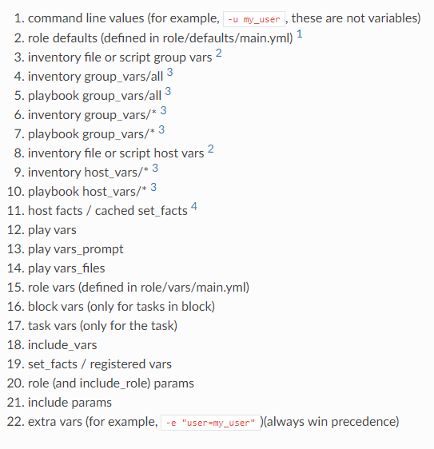

# Ansible: Variables, Facts and Conditionals
## Chris Hammer, Senior Consultant | 
---

## Objectives:
##    1: Variables
    - Defining variables 
    - Using Variables
    - Variable Precedence
        
## Variable Precedence

## 2: Facts
        - Generate host facts: CLI/Playbook
        - Generate service facts: Playbook
        - Using facts as variables
        - Filtering Facts (demo'd in Conditionals)
    
## 3: Conditionals 
        - Register
        - When
        - Including/filtering facts

