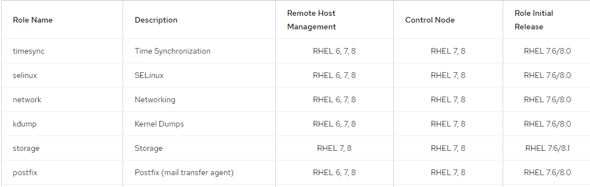

# Ansible: Roles
## Chris Hammer, Senior Architect | 
---

## Objectives:
##    1: What are roles?
        Roles let you automatically load related vars, files, tasks, handlers, and other Ansible artifacts based on a known file structure. After you group your content in roles, you can easily reuse them and share them with other users.

    - Why use them?
        Pros:
           - Simplifies playbook content. 
           - Clean structure makes it easier to update.
        Cons:
           - Can be difficult to learn dir structure/functions.
           - Adds a layer of complexity when troubleshooting. 
    - How to call a role in a playbook.
        include_role:
          name: <role_name>
        roles:
          - <role_name1>
          - <role_name2>
        
## Role Directory Structure
        testfordemo/
        ├── defaults
        │   └── main.yml
        ├── files
        ├── handlers
        │   └── main.yml
        ├── meta
        │   └── main.yml
        ├── README.md
        ├── tasks
        │   └── main.yml
        ├── templates
        ├── tests
        │   ├── inventory
        │   └── test.yml
        └── vars
        └── main.yml

## 2: Creating a Custom Role: HTTPD example
        - ansible-galaxy init <role_name>
        - tree roles/<role_name> 
        - vim roles/<role_name>/tasks/main.yml
        - Add the tasks you want to run against a host.
        - Then create a playbook that calls your role name. 

## 3: RHEL System Roles 
        - What are they?
                - RHEL System Roles is a collection of Ansible roles and modules that provide a stable and consistent configuration interface to automate and manage multiple releases of Red Hat Enterprise Linux.
                https://access.redhat.com/articles/3050101 
                - Examples:
 

        - How do I get them?
                - The RHEL System Roles are supported as provided from the following methods:
                - As an RPM package in the RHEL 7 Extras repository
                - As an RPM package in the RHEL 8 application Streams repository
                - As a supported collection in the Red Hat Automation Hub
                - Default location: /usr/share/ansible/roles/rhel-system-roles.<role-name>

                On your Existing Ansible Controller:
                - # subscription-manager  repos --enable=rhel-7-server-extras-rpms
                - # yum install rhel-system-roles
                - # vim test-playbook.yml
                - Then include the vars for the role you wish to run as well as call the role within the playbook.
        - Are they supported?
                - The effort is based on development of the Linux System Roles upstream project.
                https://linux-system-roles.github.io/ 
                